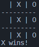

# rust_tic_tac_toe
## Overview
This is a simple project to start and get used to the Rust language, AI of adversary is very limited as that was not the main focus.
Some error handling was made taking advantage of Rust's robustness towards user misuse.

## Table of contents - [rust\_tic\_tac\_toe](#rust_tic_tac_toe)
- [rust\_tic\_tac\_toe](#rust_tic_tac_toe)
  - [Overview](#overview)
  - [Table of contents - rust\_tic\_tac\_toe](#table-of-contents---rust_tic_tac_toe)
  - [Project](#project)
  - [Images](#images)
  - [Final Thoughts](#final-thoughts)
  - [Credits](#credits)

## Project
The limitness of the project is noted as the whole point of the project was to try and get used to the Rust language as it keeps on being adopted on by some of the biggest companies due to it's memory safety features and speed.

## Images
- Start: The game starts on a empty blank, the player always being the first to place a "piece". 

- Error Handling: Due to it's in-built resistance against user incorrect input error handling is fairly easy to implement. All possibilities of pieces was not taken into consideration. 

- Game Over: The game is finished when either the user or the "AI" completes a straight line with their pieces.  

## Final Thoughts
This project is "as-is" and further updates are not going to be developed to it. In case I decide to create a better version it will be a brand new construction.

## Credits
The project was desined and created by me.